# ghst design specification — draft

Status: design recovery for review, initially recorded 2026-09-06; refactor progress
reviewed 2026-09-07. Package version 0.7.1. Section 9 records the current main-derived
implementation and completed steps, not a claim about every published release.

This document describes the product independently of its module layout. It separates
observed behavior from requirements proposed for adoption and decisions that still
need review. It does not authorize implementation changes or supersede `AGENTS.md`.

`DESIGN.md` remains the existing design reference. `REFACTOR.md` and
`IMPLEMENTATION_PLAN.md` contain previously recorded direction; their unimplemented
policies are identified here as planned, not presented as current behavior. Section 7
records the operator's reviewed product decisions. Where these differ from earlier
plans, the difference is explicit. Product-policy changes remain planned unless
explicitly recorded as implemented; architectural progress is tracked in section 9.
Section 8 records the agreed architectural direction, reviewed 2026-09-07; it is
a target for the refactor, not a claim that every boundary is implemented today.

## 1. Purpose and scope

ghst lets a trusted developer give a local tool GitHub access appropriate to a task,
using expiring, human-attributed credentials. The developer chooses the GitHub App,
authorizes access, and selects the requested permissions and repositories.

Two core workflows are supported: authenticate and run a local tool with a fresh
scoped credential and foreground-exit revocation, or obtain and export a base or
scoped credential for a receiver managing execution elsewhere. Export supports
remote systems and tools inside sandboxes; it is a required capability. Inspection,
explicit revocation, and interrupted-run recovery support both workflows.

ghst is a local CLI. A hosted broker, proxy, background renewal service, installation
token issuer, and process sandbox are outside its present scope. Supporting arbitrary
historical configuration or cache formats is also outside scope.

Both foreground execution and credential export belong in the intended product.
Base issuance remains device authorization followed by export; retaining this
capability does not imply adding implicit authentication to `token`.

## 2. Trust and authority

The operator, local configuration, and ghst process are trusted. A recipient tool
may retain or exfiltrate any credential it receives. GitHub enforces the remote
authority and expiry of credentials; ghst selects requests, validates responses,
controls local reuse, and performs cleanup.

Private filesystem permissions protect against other local users. They do not
isolate an unconfined process running as the operator. Restricting access to cached
base tokens, application secrets, other GitHub credentials, and SSH keys requires
an external isolation boundary. Injecting a narrow token does not remove those
other sources of authority.

Local profiles express the trusted operator's requested policy. They are not a
security boundary against that operator editing configuration or calling GitHub
directly. In particular, the current repository override replaces a profile's
default selection; it is not constrained to a subset of that default.

The following are proposed normative requirements, recovered from the existing
security intent. Their presence here is not a completed security audit:

| ID | Requirement |
| --- | --- |
| R1 | Issue user-attributed App user access tokens; do not substitute installation credentials. |
| R2 | Never persist or expose refresh tokens to recipients. Never log credential secrets. Deliberate token export and device authorization presentation are separate, explicit outputs. |
| R3 | A scoped request must preserve or narrow source authority and honor the resolved permission and repository request. Failure must not cause fallback to a broader credential. |
| R4 | Require a valid issuer-provided expiry. Never synthesize missing lifetime information or hand off a credential that fails the safety margin at its eligibility check. |
| R5 | Reuse a credential only when its provenance satisfies the selected profile and resolved policy. The identity basis for this check is decision D1. |
| R6 | Persist credential changes atomically in private storage. Reject insecure state and prevent stale concurrent operations from overwriting newer state. |
| R7 | Persist run recovery information before exposing a run credential. Preserve retryable recovery information when normal run revocation fails. |
| R8 | Distinguish local deletion, confirmed remote inactivity, and unknown remote status in outcomes. Never describe local deletion as remote revocation. |

The GitHub assumptions behind R1–R4 must be verified against official endpoint
documentation before adopting this draft as authoritative. This recovery pass uses
the repository's existing integration and documentation, not a fresh API audit.

## 3. Essential concepts

| Concept | Meaning |
| --- | --- |
| App authority | The configured App identity and target account, within the authority GitHub permits for the authorizing user and App installation. |
| App profile | A named source configuration. It can operate without a client secret for base-token use; scoped profiles currently require a source with a secret. |
| Scoped profile | A named request for permissions and a default repository selection, referencing exactly one app profile. Profiles do not chain. |
| Base credential | The credential obtained through device authorization, used directly by explicit app-profile export or to issue scoped credentials. |
| Scoped credential | A separately issued credential for the resolved scope, eligible for reuse according to local policy. |
| Run credential | A fresh scoped credential associated with one invocation and a durable cleanup record; never a reusable token-cache hit. |
| Provenance | Evidence tying a cached credential to its source and requested policy. Current reusable scoped records also depend on the base generation. |
| Cache slot | A local reusable-credential location selected by profile and canonical repository scope. A displayed slot ID does not identify an immutable token generation. |
| Selected user | Planned persistent source identity, independent of the base credential's continued existence. This is not yet the current storage model. |

Remote credential validity, local reuse eligibility, and possession of cleanup
information are separate facts. A credential can remain active remotely while
being ineligible for local reuse. Removing its local record does not revoke it and
may remove the information needed to revoke it later.

## 4. Current command contracts

Profile selection uses the command-line option, then `GHST_PROFILE`, then the
configuration default. Scoped repository selection uses explicit `--repo` values
when supplied, otherwise the profile default. `auto` resolves local repository
context; explicit selections are validated, sorted, and deduplicated. `all` means
no additional repository narrowing within the source authority.

| Command | Outcome and credential exposure | Persistent or remote effects |
| --- | --- | --- |
| `login` | Authenticate an app profile, or report a reusable cached base credential. Does not export the access token. Scoped profiles are rejected. | Device Flow and base persistence when authentication is needed. May open the browser. |
| `run` | Execute a foreground command with a fresh scoped credential in `GH_TOKEN` and `GITHUB_TOKEN`. Accepts scoped profiles only. | Mint, persist recovery state, launch, record child ownership, wait, and attempt revocation. |
| `token` | Export a credential as text, JSON, or environment assignments. App profiles export the base credential and reject repository overrides. | Reuse or mint a scoped credential, potentially replacing and cleaning up an earlier one. No process-exit cleanup contract for the caller. |
| `status` | Report local slot IDs, integrity, and credential lifetimes without secrets. | No network requests. Does not establish remote validity or acquisition eligibility. |
| `profiles` | Show configured profiles, optionally with details, without credential secrets. | Read configuration. |
| `revoke <id>` / `revoke --all` | Report cleanup of one current slot or all known slots, including active runs. Unknown or ambiguous IDs select nothing. | Invalidate concurrent issuance, attempt applicable remote cleanup, and delete eligible selected records. Incomplete cleanup is nonzero; invalid records are retained. |
| `prune` | Report expired-record disposal and abandoned-run recovery. Active runs are skipped conservatively. | Delete expired records; attempt cleanup of abandoned or cleanup-pending runs. It does not currently validate live reusable credentials remotely. |
| `edit` / `edit --init` | Open configuration for editing; optionally create starter configuration when absent. | Write local configuration through initialization or the chosen editor. |

Exact option syntax and output formats remain in the [command documentation](docs/src/commands/index.md).
They are existing external contracts, not implicitly approved for removal by this draft.

## 5. Credential lifecycle and failure ordering

### Authentication and reusable credentials — current behavior

Authentication reuses an eligible cached base credential before starting Device
Flow. A newly obtained credential must pass response and lifetime validation before
persistence. Concurrent persistence may retain a compatible existing winner and
clean up the unused candidate.

A reusable scoped credential must match source authority, source profile, resolved
policy, and the current cached base generation. Base expiry alone does not make a
matching child ineligible, but missing base provenance does. A usable base is
required for new issuance.

Current timing policy uses a 30-second handoff margin and a 10-minute proactive
renewal window. A matching child in the renewal window can still be returned when
the base cannot mint, provided the child remains outside the handoff margin.
Expiry is checked again at relevant later workflow stages; this draft does not
claim the planned universal final locked handoff check already exists.

Renewal persists the replacement before attempting displaced-token cleanup. A
cleanup failure can therefore produce an error after storage has changed. Failed
issuance must not be interpreted as proof that no credential was created remotely.
Unused or rejected candidates receive cleanup attempts when suitable credentials
are available; cleanup can fail.

### Foreground runs — current behavior

```mermaid
stateDiagram-v2
    [*] --> Pending: Mint and durably record credential
    Pending --> Running: Spawn child and durably record ownership
    Pending --> CleanupPending: Abort before completed handoff
    Running --> CleanupPending: Child exits or abandoned run is claimed
    CleanupPending --> [*]: Confirm inactivity and delete recovery record
    CleanupPending --> CleanupPending: Cleanup fails; retain for retry
```



The pending record exists before child exposure, but spawning and recording the
child are separate operations. If activation fails after spawning, the wrapper
terminates and waits for that child before completing failure cleanup. Durable
state transitions require matching ownership; recovery must not claim a changed
record. Expired records can be disposed of without remote revocation.

Arguments are passed without a shell. The wrapper removes GitHub Enterprise token
environment variables and forwards supported termination signals to the direct
child. Once running state is durable, the child result takes precedence over
cleanup errors: ordinary exit codes are preserved and signals map to `128 + signal`.
Pre-handoff failures return failure.

The cleanup boundary is the foreground direct child, not every descendant or a
proof that all token copies have disappeared. Crashes, forced termination, or
network failure can leave a token active until successful recovery or issuer expiry.

### Revocation and pruning — current behavior

Explicit revocation and recovery have different policies. Explicit revocation can
select active runs; prune must skip live or uncertain owners. Prune retains failed
run cleanup for retry. Explicit revocation can delete a live credential locally
when matching revocation credentials are unavailable, while reporting incomplete
cleanup. Remote revocation errors retain the record for retry.

Explicit revocation executes across three distinct phases without holding the
cache lock during network I/O:
1. **Phase A (Snapshot & Epoch Advance):** Under an exclusive cache lock, inspects
   candidate entries and advances the cache issuance epoch. Malformed, corrupt, or
   unsupported-schema records fail closed and are retained for diagnosis rather than
   deleted. Valid records are snapshotted before the lock is released.
2. **Phase B (Lockless Remote Revocation):** Outside the cache lock, requests token
   revocation from GitHub's OAuth revocation endpoint for active live tokens. Tokens
   already expired or within the 30-second handoff safety margin skip remote calls.
3. **Phase C (Locked Conditional Exact Deletion):** Under a brief lock per entry,
   deletes the record only if the on-disk file still exactly matches the pre-revocation
   snapshot. Concurrent replacements minted under the new epoch are preserved intact.

Explicit revocation deletes entries within the handoff margin without an HTTP
request, permitting up to 30 seconds of remaining remote validity. This exception
is retained under D5 and documented; successful command completion does not
universally mean immediate remote inactivity.

### Accepted cleanup direction — not yet implemented

Every command, including `status`, performs local cleanup of token files whose
issuer expiry is confirmed to have passed (`expires_at <= now`). This cleanup is
HTTP-free. It does not use the 30-second handoff margin as an expiry threshold,
discard an unexpired token merely because it is unusable, or remotely check live
credentials. Expired base credential material is removed while selected-user
metadata survives, so independently live scoped credentials remain reusable under
D1. The exact source-record layout must support that distinction.

Expiry cleanup and remote revocation are separate operations. Explicit cleanup can
recover a record unsuitable for reuse when its expiry, source app, and token can
be read and validated for revocation. A confirmed-expired token needs no remote
request. An unexpired recovered token can be revoked using matching configured app
credentials, then its exact record removed after confirmed inactivity. Recovery
must never make that record eligible for token handoff.

Remote recovery remains outside routine command maintenance. `prune` retains its
abandoned-run recovery role; no remote validity checks for live reusable tokens
will be added. Run liveness and ownership safeguards still apply during prune,
including when considering a recoverable record.

The remaining D2 design work is to define an explicit, validated cleanup
representation: which damaged records it accepts, how source authority is matched,
and what happens when required fields or matching app credentials are unavailable.
Readable text alone is not sufficient validation. Insecure files and I/O failures
remain errors. Unknown expiry is not evidence of expiration, and failed revocation
is not evidence of inactivity. This recovery path must not introduce migration or
fallback parsing for credential reuse.

## 6. Concurrency and storage contracts

Storage contracts are owned by individual features as small, focused traits:
- `credential::store::ReadCredentials` for loading cached base and scoped credentials
- `credential::store::WriteCredentials` for persisting and renewing credentials under epoch and source guards
- `credential::store::IssuanceGuardStore` for sampling the issuance guard epoch
- `run::store::PendingRunStore` for persisting initial pending run state
- `run::store::RunLifecycleStore` for run lifecycle transitions and cleanup deletion
- `token::store::InspectRecords` for listing cache state without mutating entries
- `token::store::BeginRevocation` and `DeleteInspectedRecord` for staged revocation and conditional exact deletion

The concrete filesystem adapter `CacheStore` in `src/cache/store.rs` implements these
contracts using static dispatch (`impl Trait` / generics). The public `revoke_transaction`
callback has been eliminated; locking primitives, descriptors, and callbacks are
strictly private inside `src/cache/`.

Current storage uses a cache-wide lock, an issuance epoch, source-generation
checks, and exact-entry comparisons. These implement distinct obligations:

- Revocation advances the issuance epoch during Phase A so any minting in progress
  under an older epoch is rejected at write time, and Phase C exact comparisons
  ensure concurrent replacements survive.
- Source replacement prevents a candidate minted from stale source state from
  being committed.
- Renewal replaces only the selected entry or retains a compatible concurrent winner.
- Recovery updates and deletes only the run record it owns or has validly claimed.

Reusable records, run recovery records, and configuration have different purposes.
All secret-bearing persistence requires private ownership and permissions, secure
opening, strict decoding, and atomic writes. Unsupported or malformed artifacts
currently remain untouched and cause errors; they are not cache misses. No migration
or fallback parsing is supported.

**Planned strengthening:** selected-identity changes and token handoff would share
a final locked eligibility check. A switch committed before that check prevents
old-user return; a switch afterward cannot retract a credential already authorized
for handoff. Do not promise atomicity across stdout, HTTP, or child execution.

## 7. Reviewed product decisions

The operator confirmed the following direction after reviewing this draft. These
are requirements for the intended design; current behavior remains described above.
D2 still needs a precise recovery contract before implementation. D4 is removed
from the intended scope; its identifier is retained only to explain the change
from the earlier implementation plan.

| ID | Decision | Rationale and consequences |
| --- | --- | --- |
| D1 — User identity | Keep the planned stable GitHub user identity model. | One source profile selects one user. Identity metadata survives expired base-token cleanup. Same-user reauthentication preserves otherwise matching children; user switches require atomic eligibility checks. Separate profiles support simultaneous users. |
| D2 — Recoverable artifacts | Permit cleanup and revocation when expiry, source app, and token remain recoverable and valid for that operation. | A record rejected for reuse need not be impossible to revoke. Define the minimum cleanup representation and source validation before implementation; preserve private-file and concurrency safeguards. This replaces blanket retention for recoverable records, not with unconditional invalid-file disposal. |
| D3 — Routine maintenance | Remove confirmed-expired token files at every command boundary, including status, without HTTP. | Keep the cache free of expired credential material. Use actual issuer expiry, not the handoff margin. Preserve selected identity and independently live children. Invalid or unexpired objects are not the target of this routine sweep. |
| D4 — Remote validation | Removed from scope. | Do not add remote validity checks for live reusable tokens to prune or routine maintenance. Remote revocation and abandoned-run recovery remain supported. This supersedes the earlier plan to add validation. |
| D5 — Revocation success | Keep the documented near-expiry exception and explicit incomplete outcomes. | Success means completion under the stated cleanup policy, not an unconditional promise of immediate remote inactivity. Document up to 30 seconds of residual validity and distinguish local-only deletion from confirmed revocation. |
| D6 — Export and reuse | Retain base and scoped issuance and export as required capabilities. | Receivers may run remotely or inside a sandbox. Keep reusable token export alongside fresh foreground run credentials; do not remove base export. |
| D7 — Timing | Keep fixed values: 30-second handoff margin and 10-minute renewal window. | Do not add timing configuration. Continue requiring valid issuer-provided lifetimes without a local maximum. Actual expiry remains a separate threshold for routine cleanup. |
| D8 — Profile repository meaning | Profile repositories are defaults. Explicit `--repo` selections replace them completely. | Never merge defaults into an explicit selection or silently retain implicit repositories. Source-account validation and remote authority limits still apply. Document selection precedence so users can predict the exact repository request. |

## 8. Agreed architectural direction

Organize the implementation around explicit ownership and dependency rules. Keep
pure policy separate from I/O mechanics within these boundaries. Additional generic
layers, service wrappers, or a file move alone do not establish a useful boundary.

### Module ownership

| Module | Responsibility |
| --- | --- |
| `cmd` | CLI parsing and routing, profile-selection precedence, construction of concrete dependencies, workflow invocation, presentation, and exit codes. |
| `config` | Configuration location, secure loading, decoding, validation, initialization, and editing support. Produce validated profile values; own the configuration schema. |
| `profile` | Pure profile and permission models, source relationships, and profile policy, independent of configuration files. |
| `credential` | Secret values, issuer expiry, selected identity, provenance, and credential eligibility rules. Own the focused credential-storage contracts consumed by workflows. |
| `token` | Authentication, reusable base/scoped acquisition and export preparation, fresh scoped issuance, renewal, and revocation workflows. Coordinate storage and remote operations. |
| `run` | Invocation lifecycle, durable recovery state, credential handoff, child ownership, exit cleanup, and abandoned-run recovery. Own run state transitions and storage/process contracts. |
| `repository` / `git` | A dedicated repository area: `repository` owns pure selection, validation, and canonicalization; `git` supplies local origin detection. Preserve this policy/adapter boundary regardless of file nesting. |
| `cache` | Shared persistence for reusable credentials, selected identity, and run recovery records. Own record schemas, lookup, locking, issuance epochs, and conditional state changes. |
| `fs` | Shared secure filesystem operations for configuration and cache: secure opening, descriptor validation, private permissions, atomic replacement, and durability primitives. |
| `github` | GitHub HTTP requests, external response decoding, and translation into feature-owned request/result types. Implement the client contracts consumed by workflows. |

Process creation, environment injection, signal forwarding, waiting, and liveness
inspection belong to a process adapter, which may remain private under `run`.
Browser and editor launching are adapter mechanics; they do not require new major
feature modules.

### Dependencies and orchestration

`cmd` performs command setup: load configuration, resolve the selected profile and
repository request, construct adapters, and call a feature workflow. It renders the
result afterward. The shared command boundary invokes routine local expiry cleanup
under D3; its outstanding failure-ordering decisions remain listed in section 10.

`token` and `run` own lifecycle orchestration. They receive validated inputs and use
small, feature-owned traits with static dispatch for storage, HTTP, and process
operations. They do not depend on CLI arguments, configuration DTOs, filesystem
paths, or concrete adapters. `run` uses token operations for issuance and revocation;
shared token operations must not depend on the run workflow. Pure models own policy
and state transitions without depending on I/O contracts or adapters.

`cache` implements credential and run storage contracts and uses `fs`. `config`
uses `fs` and translates its schema into profile values. `github` implements token
client contracts. Repository policy receives detected repository context from the
Git adapter without executing Git itself. Neither `cache` nor `fs` calls GitHub;
`fs` knows nothing about profiles, credential eligibility, or cache record schemas.

Credential models define eligibility; storage applies those rules inside atomic
read/check/transition/persist operations. Cache locking, exact-record comparisons,
and issuance guards stay inside the storage adapter. Workflows receive semantic
results, not lock handles or transaction closures, and must not reproduce a
conditional state change as separate unprotected reads and writes. Network calls
occur outside storage locks; commit and handoff checks enforce the concurrency
requirements in section 6.

The shared filesystem implementation must preserve each caller's security contract.
Configuration owns initialization and explicit permission-repair policy; cache owns
record layout and locking scope. Sharing primitives does not authorize automatic
repair, deletion, or relaxed validation during ordinary reads.

### Hashing and identity

Hashing belongs with the meaning of its inputs. Credential provenance fingerprints
belong in `credential`. Features define canonical logical credential and run
identities; `cache` owns their filename derivation and cache-ID lookup. Repository
canonicalization belongs in `repository`. `fs` receives validated path components
and does not interpret profile names or compute token identities. A hashed filename
does not replace secure opening, record validation, or provenance checks.

### Foreground run sequence

For `ghst run -p developer -- bash`, assuming `developer` is a scoped profile:

```text
cmd::run
  -> config: load and validate through fs
  -> resolve profile and repository selection (git origin only for auto)
  -> run: execute the invocation
      -> token: obtain a fresh scoped credential
          -> cache: read eligible base credential and issuance guard
          -> github: mint and validate the scoped response
      -> cache: conditionally persist pending recovery state through fs
      -> process adapter: spawn with the credential
      -> cache: durably record child ownership
      -> process adapter: wait and forward supported signals
      -> token: attempt remote revocation
      -> cache: remove completed record or retain retryable recovery state
  -> cmd: report outcome and return exit code
```

This describes calls and returns coordinated by workflows, not a chain in which
each adapter invokes the next. Response decoding belongs to `github`; credential
and scope invariants belong to pure models invoked before persistence and handoff.
The run path can reuse an eligible base credential for issuance, but always mints
a fresh scoped credential and never takes a reusable scoped-cache hit. Reusable
acquisition for `token` follows its separate reuse and renewal policy.

Recovery state must be durable before child exposure. If activation fails after
spawn, the run workflow terminates and waits for the child before failure cleanup.
It retains retryable recovery information when cleanup fails and preserves the
child-result precedence described in section 5. These orderings belong in `run`,
with execution mechanics delegated to the process adapter.

## 9. Implementation and evidence map

### Checkpoint: steps 1, 2, and 3 complete, 2026-09-09

Implementation on `refactor/step-3-storage-contracts` completed Step 3.
Steps 1 and 2 established filesystem security and domain models; Step 3 established
feature-owned storage dependency contracts, static-dispatch storage adapters, and
lockless-network revocation.

| Step | Completed scope | Handoff plan |
| --- | --- | --- |
| 1 — Shared filesystem | `src/fs.rs` owns shared secure opening, descriptor validation, explicit permission-repair mechanics, and atomic publication/sync. Config retains default/custom-parent and repair policy. Cache retains locking and epochs in `src/cache/lock.rs`. Cache reads now validate opened descriptors with nonblocking opening. | [Step 1 plan](REFACTOR_STEP_1_FS_CACHE.md) |
| 2 — Models and cache serialization | `src/credential.rs` owns secret/expiry values, base/scoped models, compatibility, and fingerprints. `src/run.rs` owns run records and pure lifecycle transitions. Cache owns private DTOs and checked conversion; consumers use models through the non-serializable `Record` result. | [Step 2 plan](REFACTOR_STEP_2_CACHE_MODELS.md) |
| 3 — Storage contracts and lockless revocation | Feature modules (`credential`, `token::scoped`, `run`, `token::cleanup`, `token::store`) own focused storage traits. `src/cache/store.rs` implements `CacheStore` via static dispatch. `revoke_transaction` callback removed. Revocation performs three-phase lockless-network lifecycle (Phase A snapshot/epoch advance -> Phase B lockless remote HTTP -> Phase C locked conditional exact deletion). Malformed/unsupported entries fail closed and are retained. | [Step 3 plan](REFACTOR_STEP_3_STORAGE_CONTRACTS.md) |

Step 3 completely decouples `src/token`, `src/credential`, and `src/run` from concrete
`crate::cache` types and filesystem paths. Feature modules define small, focused traits
(`ReadCredentials`, `WriteCredentials`, `IssuanceGuardStore`, `PendingRunStore`,
`RunLifecycleStore`, `InspectRecords`, `BeginRevocation`, `DeleteInspectedRecord`),
and workflows use generics with trait bounds.
Cache locking descriptors and transaction callbacks are completely private to `src/cache`.
The public `revoke_transaction` callback was removed.

Revocation executes across three phases without holding the cache lock during network calls:
Phase A snapshots matching entries under an exclusive lock and advances the issuance epoch;
Phase B executes remote token deletion via GitHub's API outside the lock; Phase C verifies
and deletes matching entries under a brief lock per entry. Concurrent replacements minted
under the advanced epoch survive intact. Malformed or unsupported cache files are never
silently deleted; they fail closed, are reported in `RevokeReport.failures`, and are retained
on disk.

Validation at this checkpoint: `cargo fmt --check`, `cargo check`, `cargo clippy --all-targets`,
and all 213 tests passed. Concurrency and failure ordering tests prove:
- epoch advance during Phase A invalidates concurrent in-flight token issuance and renewal
- exact deletion distinguishes deleted, missing, and changed records
- cache lock is not held across network I/O during revocation
- concurrent replacements during lockless revocation survive Phase C finalization
- exact handoff-margin boundaries (inside vs outside 30 seconds)
- active run revocation deletes exact records
- GitHub 404 (already inactive) is treated as successful revocation
- unsupported schemas and inconsistent metadata are retained on disk with failure reports

### Remaining architectural work

The section 8 module table remains the target. Profile models still live in
`domain::profile`. Run workflow code remains in `src/token/run.rs`, with process
orchestration in `src/cmd/run.rs`; the crate-root `run` currently owns models and
storage contracts. Token workflows still perform configuration lookup in
`token/provenance.rs`. Command/workflow separation and configuration-independent
workflow inputs are the next priorities (Step 4).

### Evidence map

The following evidence anchors support review. They are representative coverage,
not a claim that each requirement is fully proven. Existing tests must be reviewed
against adopted policy rather than treated as authority for preserving all behavior.

| Requirement or contract | Implementation / evidence |
| --- | --- |
| R2: secret handling | `src/credential.rs`, `src/github/types.rs`; `secrets_are_redacted_and_zeroizing_type_serializes` in `src/cache/tests.rs`. Refresh-token disposal needs its own boundary review. |
| R3: resolved scope | `src/repository.rs`, `src/token/scoped.rs`; `scoped_acquisition_sends_exact_narrowing_request` in `src/token/tests.rs`. Remote enforcement remains an external dependency. |
| R4: expiry and fallback | `src/token/validation.rs`, `src/token/acquire.rs`; response-receipt and handoff-margin tests in `src/token/tests.rs`. |
| R5: current provenance | `src/credential.rs`, `src/token/provenance.rs`; fixed fingerprint values and compatibility tests in credential, missing-base-provenance and independent-child-expiry tests in `src/token/tests.rs`. Planned user-identity behavior is not covered by these tests. |
| R6: atomic storage and contracts | `src/fs.rs`, `src/cache/lock.rs`, `src/cache/storage.rs`, `src/cache/store.rs`; publication failure tests in `src/fs/tests.rs`, epoch advance and exact-deletion tests in `src/cache/tests.rs`, concurrent replacement and lockless revocation tests in `src/token/revoke.rs`. |
| R7: run ownership and recovery | `src/run.rs`, `src/cache/run_storage.rs`, `src/token/run.rs`, `src/cmd/run.rs`; model transition tests, storage ownership tests, and `src/token/cleanup.rs` recovery tests. |
| R8: cleanup and revocation outcomes | `src/token/revoke.rs`, `src/token/cleanup.rs`; local-only revocation, authority mismatch, failed-cleanup, handoff margin boundary, and malformed-record retention tests. |
| Persistence schema boundary | `src/cache/types.rs`, `src/cache/storage.rs`; `current_cache_schema_is_stable_and_round_trips` covers unchanged schemas and checked per-kind conversion; unsupported-schema retention tests in `src/cache/tests.rs` and `src/token/revoke.rs`. |
| Configuration and output contracts | `src/config/`, `src/cmd/`, and `docs/src/commands/`; exact schemas and output compatibility require a focused inventory before changes. |

## 10. Adoption and next work

Resume from the implementation checkpoint in section 9. For product-policy
adoption, review sections 1–3 against the accepted decisions in section 7, then specify the
remaining D2 recovery details and command-boundary failure ordering. In particular,
decide how cleanup failures affect an otherwise unrelated command and how help,
version output, and initial configuration creation enter that boundary. Architectural
refactoring must not implicitly decide those policies or carry forward the removed
remote-validation phase.

Before promoting this draft to the authoritative specification:

1. Verify GitHub issuance, scope, lifetime, and revocation assumptions against
   official documentation; distinguish external guarantees from local checks.
2. Complete the command/output and persistence-schema inventory where an adopted
   decision would change an existing contract.
3. Map each adopted requirement to implementation, focused evidence, and any known
   gap. Add tests for uncovered invariants rather than duplicating caller coverage.
4. Reconcile `AGENTS.md`, `DESIGN.md`, the refactoring documents, and user guidance
   so current policy and future work cannot be confused. Choose one authoritative
   specification and retire duplicate normative text.
5. Derive small implementation changes from demonstrated gaps. Run the repository's
   required checks for each change; keep unrelated redesign out of those patches.

The specification is ready when a reviewer can predict scope, identity, expiry,
local state, and reported outcome for each command—including races and failures—
without having to reconstruct the implementation.
