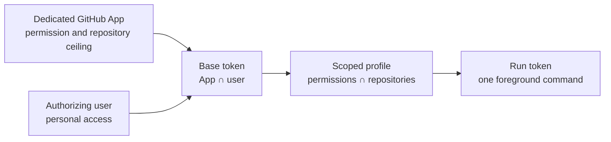

<h1 align="center">ghst</h1>

<p align="center">
  <strong>Ephemeral GitHub access. Explicit scope.</strong>
</p>

<p align="center">
  <code>ghst</code> (pronounced “ghost”) mints short-lived, least-privilege GitHub user access
  tokens for AI coding agents and developer tools. Each run token is user-attributed and
  constrained by a dedicated GitHub App, a local permission profile, and explicit repositories.
</p>

<p align="center">
  <a href="https://github.com/c0rner/ghst/releases"></a>
  <a href="https://c0rner.github.io/ghst/"></a>
  <a href="SECURITY.md"></a>
  <a href="LICENSE"></a>
</p>

<p align="center">
  <a href="#quick-start">Quick start</a> ·
  <a href="#why-ghst">Why ghst</a> ·
  <a href="#what-ghst-does">Capabilities</a> ·
  <a href="#how-it-works">How it works</a> ·
  <a href="#security-boundaries">Security</a> ·
  <a href="#documentation">Docs</a>
</p>

## Quick start

`ghst` supports Linux and macOS. Install it with Cargo, or download a prebuilt archive and its
checksum from [GitHub Releases](https://github.com/c0rner/ghst/releases):

```console
$ cargo install --locked ghst
```

Before authenticating, create a
[dedicated GitHub App](https://c0rner.github.io/ghst/getting-started/github-app.html) with only the
permissions and repositories your tools need. Enable Device Flow and expiring user access tokens,
and do not generate a private key.

Create the starter configuration and replace its placeholders with your App details:

```console
$ ghst edit --init
$ ghst login --profile developer
```

Complete the Device Flow in a trusted browser. Then run a tool with a fresh token from a narrow
scoped profile:

```console
# Read-only access to the current repository
$ ghst run --profile reader -- codex

# Add process isolation for a less-trusted tool
$ ghst run --profile reader -- nono run --allow . -- claude
```

The child receives the token in `GH_TOKEN` and `GITHUB_TOKEN`. When the foreground command exits,
`ghst` requests immediate revocation and returns the child’s exit code.

See the [complete quickstart](https://c0rner.github.io/ghst/getting-started/quickstart.html) for the
starter profile and verification commands.

## Why ghst

Developer tools often inherit a broad Personal Access Token, GitHub CLI session, or other ambient
workstation credential. Any process that can read that credential can retain it and act with its
full authority long after the original task ends.

**Least privilege.** A run token contains only the requested permissions and repository access,
bounded by the dedicated GitHub App and the authorizing user.

**Short-lived.** Tokens expire, and `ghst run` requests revocation as soon as the foreground child
exits.

**User-attributed.** Operations remain associated with the human who completed Device Flow instead
of an unaccountable App installation identity.

**Fail closed.** Malformed or unsupported configuration and cache state is rejected. `ghst` does
not widen scope, fall back to broader credentials, or persist OAuth refresh tokens.

These controls limit two closely related threats:

- **Untrusted tooling:** AI agents, plugins, and developer tools receive task-specific authority
  instead of ambient credentials with broad access.
- **Supply-chain attacks:** A compromised dependency may exfiltrate any token visible to its
  process and use repository write access to compromise other projects. Short-lived,
  repository-scoped tokens constrain how far and how long that attack can spread.

## What ghst does

| Capability | What it gives you |
|---|---|
| **Permission ceilings** | A dedicated GitHub App places a platform-enforced upper bound on permissions and repository access. |
| **Scoped profiles** | Named TOML profiles narrow an App-backed base token to task-specific permissions and repositories. |
| **Repository resolution** | Select explicit `owner/repository` targets, all repositories inside the existing ceiling, or the current repository with `auto`. |
| **Foreground credential leases** | `ghst run` mints a fresh token, injects it into one child process, and requests revocation when that process exits. |
| **Recovery after interruption** | Durable run state lets `ghst prune` recover abandoned tokens without disturbing active runs. |
| **Explicit revocation** | Revoke one cached credential by status ID or submit every locally known credential for revocation. |
| **Inspectable state** | `ghst profiles` and `ghst status` show effective configuration and cached credential metadata without printing secrets. |

## How it works



The dedicated GitHub App is the administrative ceiling: no profile can grant authority outside
its permissions or installation repositories. `ghst login` uses GitHub Device Flow to obtain an
expiring base token representing the intersection of that ceiling and the authorizing user’s
access.

A scoped profile narrows the base token again. `ghst run` mints a fresh run token from that scope,
records private recovery state before exposure, and starts the command directly without a shell.
On exit it requests remote revocation; if cleanup cannot complete, the retained state allows
`ghst prune` to retry later.

Read [Permission ceiling](https://c0rner.github.io/ghst/concepts/permission-ceiling.html) and
[Profiles and tokens](https://c0rner.github.io/ghst/concepts/profiles-and-tokens.html) for the full
authority and lifecycle model.

## Security boundaries

> [!IMPORTANT]
> `ghst` controls GitHub credential authority and lifetime. It is **not a process sandbox** and
> cannot stop a child from reading other credentials or files available to it.

Always deny less-trusted tools access to `~/.config/ghst/`, `~/.cache/ghst/`, GitHub CLI state,
SSH keys, Git credential helpers, and other secrets. Combine `ghst` with a
[kernel sandbox or MicroVM](https://c0rner.github.io/ghst/recipes/sandboxing.html) when the child
process should not inherit the operator’s workstation access.

A GitHub App used by `ghst` must have:

- Only the minimum permissions and repository installations required
- Device Flow enabled
- Expiring user access tokens enabled
- No private keys—private keys bypass human authorization
- A client secret only when scoped profiles or remote revocation are needed

The [Security model](https://c0rner.github.io/ghst/security/) documents the complete threat model,
trust assumptions, credential consequences, local boundaries, and incident response guidance.

## Documentation

| Section | Start here |
|---|---|
| **Getting started** | [Installation](https://c0rner.github.io/ghst/getting-started/installation.html) · [GitHub App setup](https://c0rner.github.io/ghst/getting-started/github-app.html) · [Quickstart](https://c0rner.github.io/ghst/getting-started/quickstart.html) |
| **Concepts** | [Permission ceiling](https://c0rner.github.io/ghst/concepts/permission-ceiling.html) · [Profiles and tokens](https://c0rner.github.io/ghst/concepts/profiles-and-tokens.html) · [Security boundaries](https://c0rner.github.io/ghst/concepts/security-boundaries.html) |
| **Configuration** | [Global options](https://c0rner.github.io/ghst/configuration/global.html) · [App profiles](https://c0rner.github.io/ghst/configuration/app-profiles.html) · [Scoped profiles](https://c0rner.github.io/ghst/configuration/scoped-profiles.html) · [Repositories](https://c0rner.github.io/ghst/configuration/repositories.html) |
| **Commands** | [`edit`](https://c0rner.github.io/ghst/commands/edit.html) · [`login`](https://c0rner.github.io/ghst/commands/login.html) · [`run`](https://c0rner.github.io/ghst/commands/run.html) · [`token`](https://c0rner.github.io/ghst/commands/token.html) · [`status`](https://c0rner.github.io/ghst/commands/status.html) · [`prune`](https://c0rner.github.io/ghst/commands/prune.html) · [`revoke`](https://c0rner.github.io/ghst/commands/revoke.html) |
| **Recipes** | [AI agents](https://c0rner.github.io/ghst/recipes/ai-agents.html) · [GitHub CLI](https://c0rner.github.io/ghst/recipes/github-cli.html) · [Sandboxing](https://c0rner.github.io/ghst/recipes/sandboxing.html) · [Multiple repositories](https://c0rner.github.io/ghst/recipes/multi-repository.html) |
| **Operations** | [Common failures](https://c0rner.github.io/ghst/troubleshooting/common-failures.html) · [Cleanup and recovery](https://c0rner.github.io/ghst/troubleshooting/cleanup.html) · [Incident response](https://c0rner.github.io/ghst/troubleshooting/incident-response.html) |

The searchable [ghst User Manual](https://c0rner.github.io/ghst/) is generated from
[`docs/src/`](docs/src/).

## Reporting security vulnerabilities

Do not report security vulnerabilities in public issues. Use the private
[GitHub Security Advisory form](https://github.com/c0rner/ghst/security/advisories/new) or read the
[security policy](SECURITY.md).

## Development

```console
$ cargo check
$ cargo clippy --all-targets --all-features -- -D warnings
$ cargo fmt --check
$ cargo test --all-features
$ mdbook build docs
```

## License

Licensed under the [Apache License, Version 2.0](LICENSE).
