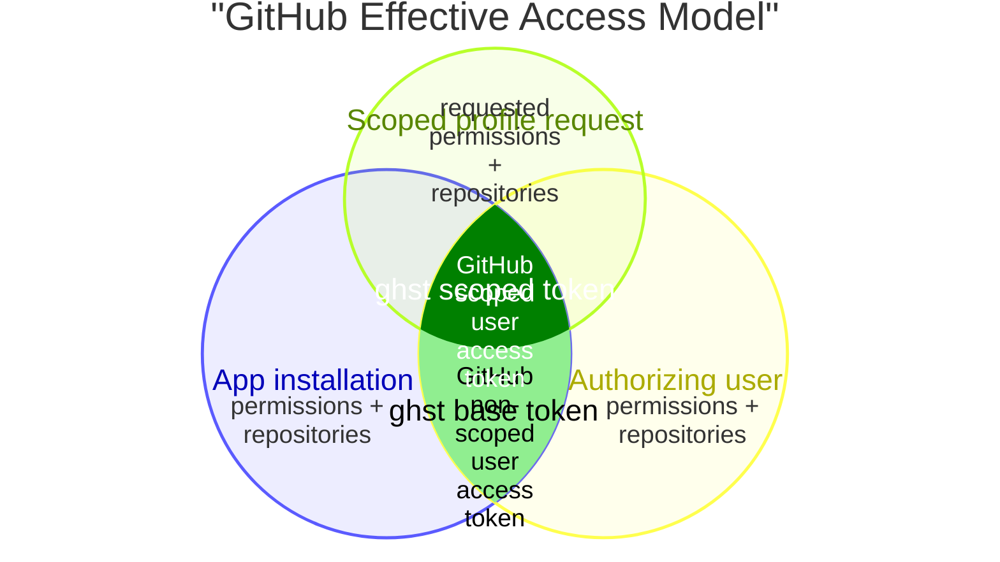

# Security Architecture & Threat Model

`ghst` issues short-lived GitHub App user access tokens to humans and AI coding tools. Its purpose
is to reduce the GitHub authority and credential lifetime delegated by a trusted operator to a
less-trusted local process.

> [!IMPORTANT]
> The security claims in this document depend on the GitHub App being configured exactly as
> described below. In particular, the App must use expiring user access tokens and must have no
> private keys. The human operator is responsible for authorizing only Device Flows that they
> initiated locally with `ghst`.

---

## Required GitHub App Configuration

Use a dedicated GitHub App for `ghst`. Do not share the App with a server, automation system, or
other integration that needs a private key or a callback-based OAuth flow.

| GitHub App setting | Required value | Security reason |
| --- | --- | --- |
| **Permissions** | Only the repository, organization, and account permissions that `ghst` users need | The App permissions are a platform-enforced ceiling. Scoped profiles can narrow this ceiling but cannot repair an unnecessarily broad installation. |
| **Installation repositories** | Only the repositories that may be accessed through this App | A token cannot access repositories outside the App installation, but `all` in a scoped profile applies no further repository narrowing. |
| **Enable Device Flow** | Enabled | `ghst login` uses only GitHub's Device Flow. GitHub documents this as the flow intended for CLI and headless applications. |
| **Request user authorization (OAuth) during installation** | Disabled | `ghst` does not use install-time or callback-based web authorization. Keep other OAuth workloads on a separate App. |
| **Callback URL** | Empty | Device Flow does not use a redirect URI. An empty callback configuration prevents this dedicated App from also serving a web application flow. |
| **Expire user authorization tokens** / **User-to-server token expiration** | Enabled | GitHub then returns an expiring user access token and a refresh token. `ghst` requires the access-token expiry and destroys the refresh token. |
| **Client secret** | Generate only if scoped profiles or remote revocation are needed | The secret enables scoped-token and revocation endpoints but is not used by Device Flow. It must remain private even though exposure alone has bounded authority. |
| **Private keys** | **None** | A private key can authenticate as the App and mint installation access tokens, bypassing the authorizing-user intersection on which `ghst` relies. |
| **Webhooks** | Disabled | `ghst` does not consume webhooks. A workload that needs them should use a separate App. |

GitHub exposes Device Flow and install-time OAuth as separate settings. “Device Flow only” in this
threat model means that Device Flow is enabled, install-time OAuth is disabled, and no other
callback-based OAuth client shares this App. GitHub notes that the callback URL is ignored when an
App uses Device Flow. See GitHub's guides to [registering a GitHub App](https://docs.github.com/en/apps/creating-github-apps/registering-a-github-app/registering-a-github-app),
[modifying its authorization settings](https://docs.github.com/en/apps/maintaining-github-apps/modifying-a-github-app-registration),
and [choosing minimum permissions](https://docs.github.com/en/apps/creating-github-apps/registering-a-github-app/choosing-permissions-for-a-github-app).

After saving the registration, verify that the **Private keys** list is empty, install the App only
on the intended account and repositories, and copy its client ID into the app profile. Generate a
client secret only when scoped profiles or remote revocation are required, store it in the `0600`
configuration file, and set `github_app.account` to the target account that owns the permitted
repositories. A secretless app profile can perform Device Flow login but cannot mint scoped tokens or
remotely revoke tokens through the App-authenticated endpoints.

### No Private Keys

> [!CAUTION]
> A GitHub App used by `ghst` must never have a private key. If the App's **Private keys** list is
> non-empty, it does not satisfy this threat model. Delete every key, and use a different GitHub App
> for any workload that must authenticate as an App installation.

A client secret and a private key are not interchangeable:

- A **client secret** authenticates the App at OAuth application endpoints. The scoped-token
  endpoint still requires an existing non-scoped user access token, and Device Flow still requires
  an explicit human authorization.
- A **private key** signs an App JWT. A holder can use that JWT to request an installation access
  token without a human authorizing a user flow. Unless the request narrows it, that installation
  token receives all permissions and repositories granted to the installation.
- Installation-token authorization depends on the App installation, not on a particular user's
  access. Actions are attributed to the App rather than to the accountable human operator.
- GitHub App private keys do not expire automatically. They remain useful until manually deleted.

GitHub documents that a JWT signed by an App private key can mint an
[installation access token](https://docs.github.com/en/apps/creating-github-apps/authenticating-with-a-github-app/generating-an-installation-access-token-for-a-github-app),
and explicitly recommends user access tokens for actions performed on behalf of users in its
[GitHub App security guidance](https://docs.github.com/en/apps/creating-github-apps/about-creating-github-apps/best-practices-for-creating-a-github-app).

---

## Trust and Accountability Assumptions

`ghst` protects a trusted human operator's GitHub authority from less-trusted processes running on
the same machine. It is not an insider-resistant control against the workstation owner.

The model assumes all of the following:

1. **The operator and App administrators are trusted.** They preserve the required App settings,
   do not generate private keys, and do not deliberately bypass `ghst`.
2. **The operator protects their GitHub account.** An attacker who can sign in as the user can grant
   or use the user's authority outside `ghst`.
3. **Every Device Flow approval is deliberate and in-bound.** The operator approves only a code
   produced by a `ghst login` command they personally started and that is still waiting locally.
4. **Less-trusted processes cannot read `ghst` state.** AI tools, repository scripts, and build
   processes must be denied access to `~/.config/ghst/` and `~/.cache/ghst/` when they are not fully
   trusted.
5. **GitHub enforces its documented token boundaries.** User access tokens remain limited by both
   the App installation and the authorizing user's access, and a scoped user token cannot widen
   the authority of the non-scoped user token supplied to create it.

The operator remains accountable for every authorization made through their GitHub account. If the
operator authorizes an unexpected device code, GitHub correctly treats that as consent; `ghst`
cannot determine that the approval was socially engineered or intended for another process.

> [!NOTE]
> Local `ghst` is appropriate when an organization already trusts developers with repository
> access and wants to constrain what they delegate to AI tools. An organization that must constrain
> the developer as an adversary needs a centrally administered security boundary, not a local CLI
> controlled by that developer.

---

## Why Client-Secret Exposure Is Bounded

Calling a `client_secret` “safe to expose” would be misleading. It remains a credential, must be
stored privately, and should be rotated after exposure. The narrower claim made by `ghst` is:

> [!NOTE]
> Under the required App configuration, possession of the client secret **alone** does not grant
> repository access and cannot mint an installation access token.

This boundary exists because the client secret does not represent either a user or an App
installation:

- Starting and completing GitHub Device Flow uses the public `client_id`, not the client secret.
  GitHub returns a token only after a user enters the device code and authorizes the App.
- Creating a scoped user access token requires both App authentication (`client_id` plus
  `client_secret`) and an existing non-scoped user access token. The new token can preserve or
  narrow repositories and permissions but cannot widen the supplied user's authority.
- Minting an installation access token requires an App JWT signed with a private key. The required
  no-private-key configuration removes that authentication path.
- Revocation and token-inspection endpoints require the caller to identify a token. The client
  secret is not itself a bearer token for repository APIs.

The conclusion changes when the secret is combined with other material:

| Material held by an attacker | Consequence |
| --- | --- |
| Public `client_id` only | Can initiate Device Flow and attempt to convince a user to authorize it. This risk exists even when no client secret is configured locally. |
| `client_secret` only | Can authenticate as the OAuth application at applicable endpoints, but has no user or installation authority to access repositories. |
| `client_secret` plus a live `ghst` base token | Can create independently expiring scoped user tokens while the base token is usable. Those tokens cannot exceed its App/user authority. |
| Device-Flow refresh token | Can renew the user access token using the public client ID; GitHub does not require the client secret for a refresh token issued through Device Flow. |
| Private key | Can sign App JWTs and mint installation access tokens for App installations, bypassing the user intersection. This is why private keys are forbidden. |
| GitHub App administration access | Can change permissions or authorization settings and generate a private key. App administration is therefore part of the trusted computing base. |

The [scoped-token endpoint](https://docs.github.com/en/rest/apps/apps?apiVersion=2022-11-28#create-a-scoped-access-token)
documents both required inputs: Basic authentication with the client ID and secret, plus the
non-scoped user token to be narrowed.

---

## Device Flow and Human Authorization

Device Flow is intentionally usable by public clients. Anyone who learns the App's public client ID
can request a device code; leaking the client secret is not required. The security boundary is the
human approval on GitHub.

If an attacker starts a flow and persuades a user to approve it, the attacker polling that flow
receives the user access token and its refresh token. Because a Device-Flow refresh does not require
the client secret, that access can continue beyond the lifetime of one refresh token: a successful
refresh rotates both the access token and refresh token. Access can therefore continue until the
authorization, the user's access, the App's access, or the credentials are revoked, or the current
refresh token expires before it is used. `ghst` can destroy only the refresh tokens returned to its
own process; it cannot destroy a token returned to an attacker-controlled flow.

> [!IMPORTANT]
> Authorize a device code only when all of these are true:
>
> 1. You personally started `ghst login` in a trusted local terminal.
> 2. That exact invocation is still waiting for authorization.
> 3. You manually entered the user code printed by that invocation at
>    `https://github.com/login/device`.
> 4. GitHub displays the dedicated App you expect and the access being requested is appropriate.
>
> Never authorize a device code supplied through chat, email, a web page, an issue, an AI agent, or
> another person's terminal. Matching the expected App name is necessary but not sufficient: an
> attacker can initiate a flow for the same App using its public client ID.

If any context is unexpected, deny the request and restart `ghst login` yourself. `ghst` opens only
the device verification URL and requires manual code entry; it never presents a pre-filled
`?user_code=...` link. This creates a deliberate verification step, but it cannot protect a user who
approves an out-of-bound request.

GitHub's [Device Flow documentation](https://docs.github.com/en/apps/creating-github-apps/authenticating-with-a-github-app/generating-a-user-access-token-for-a-github-app)
shows that the flow and polling request require the client ID, device code, and grant type—not the
client secret. Its [refresh-token documentation](https://docs.github.com/en/apps/creating-github-apps/authenticating-with-a-github-app/refreshing-user-access-tokens)
states that the client secret is not required when the original token came from Device Flow.

---

## Permission Ceiling and Scope Intersection

The terms in this document deliberately distinguish local `ghst` configuration from GitHub
credentials:

| `ghst` term | GitHub meaning |
| --- | --- |
| **App profile** | Local configuration identifying a GitHub App and target account. |
| **Base token** | GitHub's non-scoped user access token obtained through Device Flow. |
| **Scoped profile** | A local request for repository and permission restrictions. |
| **Scoped token** | GitHub's separate scoped user access token returned by the scoped-token endpoint. |
| **Run token** | A fresh scoped token whose cleanup lease is tied to one top-level command invocation. |
| **Installation access token** | A different, App-attributed credential that requires a private-key-signed JWT; `ghst` never uses it. |

GitHub enforces two boundaries for a user access token. Their intersection is what `ghst` calls a
base token. `ghst` supplies a third boundary when it asks GitHub to create a scoped token:

1. **App installation:** The token cannot exceed the permissions and repository access granted to
   the GitHub App installation.
2. **Authorizing user:** The token cannot perform an operation the authorizing user could not
   perform. This is the user intersection that an installation token would bypass.
3. **Scoped profile request:** `ghst` asks GitHub to preserve or further restrict repositories and
   permissions. The request can never widen the first two boundaries.



GitHub describes this distinction in its
[permission guidance](https://docs.github.com/en/apps/creating-github-apps/registering-a-github-app/choosing-permissions-for-a-github-app):
user-token requests depend on both App and user permissions, while installation-token requests
depend on App permissions.

---

## Credential Lifetimes and Storage

1. `ghst` accepts the GitHub-issued lifetime rather than synthesizing or extending one locally.
   With user-to-server token expiration enabled, GitHub currently documents an eight-hour user
   access token and a six-month lifetime for each refresh token. Six months is not a hard limit on
   the authorization: a successful refresh rotates both tokens and starts a new refresh-token
   lifetime.
2. Refresh tokens are wrapped in zeroizing memory, dropped immediately after parsing, never cached,
   and never returned to downstream tools.
3. `ghst` base tokens and reusable scoped tokens are stored under `~/.cache/ghst/`. One-off run
   tokens are stored temporarily in private recovery entries so interrupted cleanup can be retried.
4. Base and scoped tokens have independent GitHub-issued expiries. Revoking or expiring a base
   token is not assumed to revoke already-created scoped tokens.

Configuration and cache state have different enforcement:

- `ghst` requires the default `~/.config/ghst/` path to be a non-symlinked directory owned by the
  effective user with mode `0700`. It requires `profiles.toml` to be a regular, single-link file
  owned by the effective user with mode `0600`, and opens it relative to the validated directory
  without following symbolic links. It may contain a client secret.
- `ghst` enforces mode `0700` on `~/.cache/ghst/` and mode `0600` on cache entries and
  `.cache.lock`.
- Cache writes are atomic; symlinked, hard-linked, malformed, or insecure cache state fails closed.
- Platforms without Unix private-permission semantics cannot persist tokens.

Possession of the local client secret becomes more consequential when paired with a cached base
token. Configuration and cache must therefore be protected as one credential boundary, even though
the client secret alone has bounded authority.

---

## Sandboxing Less-Trusted Tools

`ghst run` is a credential-lifetime wrapper, not a kernel sandbox. Run it outside the sandbox and
place the sandboxed foreground command inside it:

```bash
ghst run --profile contributor --repo auto -- \
  nono run --allow . -- codex
```

The sandbox must deny access to `~/.config/ghst/`, `~/.cache/ghst/`, GitHub CLI authentication,
Git credential helpers, SSH keys, and other fallback credentials. The scoped token is intentionally
available to the sandboxed process through `GH_TOKEN` and `GITHUB_TOKEN`; exfiltration remains
possible until revocation or issuer expiry.

Keep the workload in the foreground. If the top-level command daemonizes, backgrounds a child, or
detaches its sandbox session, `ghst` revokes the lease when the top-level invocation exits. The
lease does not follow arbitrary descendants.

---

## Threat Matrix

| Risk | Boundary or mitigation |
| --- | --- |
| **Out-of-bound Device Flow authorization** | Human-gated but high impact. The operator must reject every flow they did not initiate locally. App-name matching alone cannot distinguish an attacker using the same public client ID. |
| **Client secret exposure alone** | Does not directly grant repository access under the required configuration. Rotate it anyway, inspect App settings, and investigate whether it was paired with a user token or authorization artifact. |
| **Client secret plus base-token exposure** | Allows additional scoped user tokens with independent lifetimes, but cannot exceed the base token's App/user intersection. Protect configuration and cache together. |
| **Refresh-token exposure** | Enables renewable user access. `ghst` destroys only refresh tokens it receives; it cannot protect an attacker-controlled flow. |
| **Departing or malicious developer retains a refresh token** | Outside the trusted-operator boundary. A workstation owner can complete Device Flow outside `ghst` and retain the rotating refresh token, bypassing local lifetime policy. Offboarding must remove the user's GitHub access and authorization; suspected unknown credentials require the centralized App controls below. |
| **Private key present or exposed** | Outside the threat model and critical. It enables App JWTs and installation access tokens without a user intersection. Delete the key and treat every App installation as potentially affected. |
| **GitHub App administrator compromise** | Outside the local boundary. An administrator can change permissions, authorization settings, installations, secrets, and private keys. |
| **Scoped-token exfiltration** | Bounded by the profile, App/user intersection, and token expiry, but usable until revoked or expired. |
| **Base-token exfiltration** | Bounded by the App/user intersection and expiry. Pairing it with the client secret enables scoped-token creation. |
| **Cleanup interruption** | Issuer expiry is the final bound. `ghst prune` retries abandoned run-token cleanup; `ghst revoke <id>` targets one status-reported cache slot, while `ghst revoke --all` attempts remote revocation and local purge for every credential represented in this workstation's cache. |
| **Trusted operator bypass** | Out of scope. A workstation owner can use another GitHub credential or deliberately expose local state. |

---

## Responding to Credential or Configuration Exposure

Stop authorizing Device Flows and inspect the GitHub App registration for changed permissions,
installations, OAuth settings, and any private keys. Then use the narrowest control that contains
the suspected credentials:

1. **Clean up this workstation.** Run `ghst revoke --all` while the configured client secret is
   still usable. It immediately deletes all locally cached credentials and attempts to revoke each
   live credential it can identify. Treat a nonzero result as incomplete cleanup. This command
   cannot discover or revoke refresh tokens retained by another client or workstation.
2. **Offboard one user.** Remove the user's repository and organization access, or disable the
   account, to remove the user side of the App/user permission intersection. Where possible, also
   revoke that user's authorization of the GitHub App from the user's GitHub application settings.
3. **Contain one installation.** Suspend or uninstall the App for an affected organization or user
   account. This removes the App side of the intersection for that installation and affects every
   user relying on it there.
4. **Break glass across the App.** If refresh tokens may be attacker-controlled, unknown, or spread
   across workstations, local cleanup is insufficient. At the time of writing, GitHub App settings
   provide a red **Revoke all user tokens** button. Its confirmation warns that every user must
   authorize the App again and that SSH keys created by the App will be deleted. Treat this as an
   irreversible App-wide emergency action, not a normal `ghst` workflow. GitHub's
   [security-log reference](https://docs.github.com/en/authentication/keeping-your-account-and-data-secure/security-log-events#integration)
   identifies the resulting `integration.revoke_all_tokens` event, but GitHub does not publicly
   document the UI procedure or its effects. Do not assume revocation is instantaneous: one
   [GitHub Community report](https://github.com/orgs/community/discussions/173651) observed a user
   access token remain usable briefly before a later request confirmed revocation. Verify that
   affected tokens no longer work and contact GitHub Support if they remain active. Confirm the
   warning shown by GitHub before proceeding; the control may change. A dedicated App limits the
   collateral impact.

Delete any exposed private key immediately; because it could have minted installation access
tokens, review every installation and suspend or uninstall the App as appropriate. Rotate an
exposed client secret and update `profiles.toml`, but do not treat secret rotation as token
revocation: Device-Flow refresh does not require the client secret, so rotating it alone does not
invalidate Device-Flow refresh tokens.

---

## Reporting a Security Vulnerability

Do not report suspected vulnerabilities in public GitHub issues. Contact the maintainers privately
or use the repository's private security-advisory mechanism.
